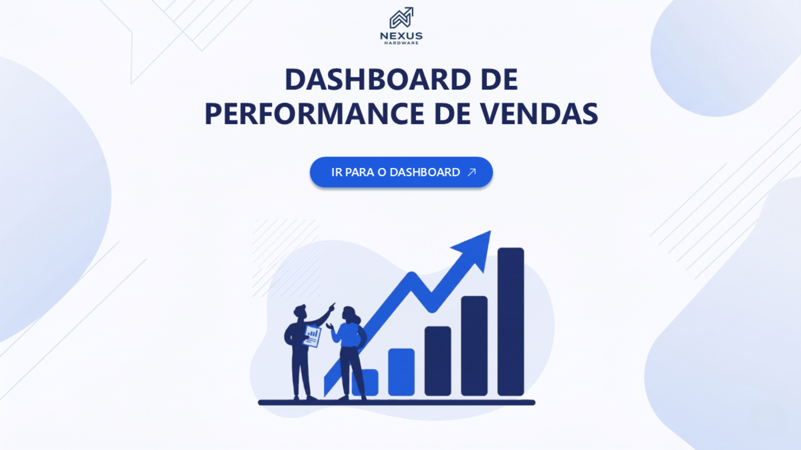
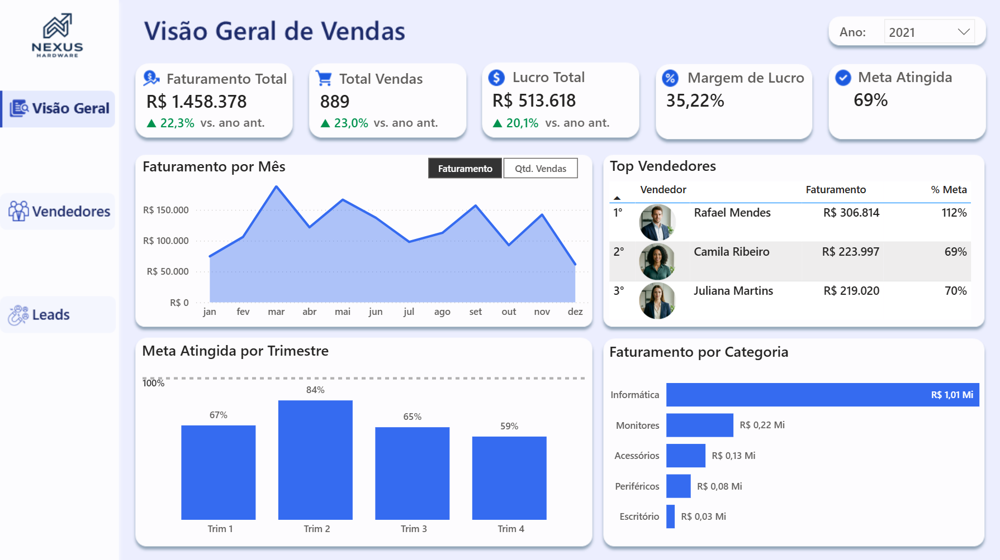
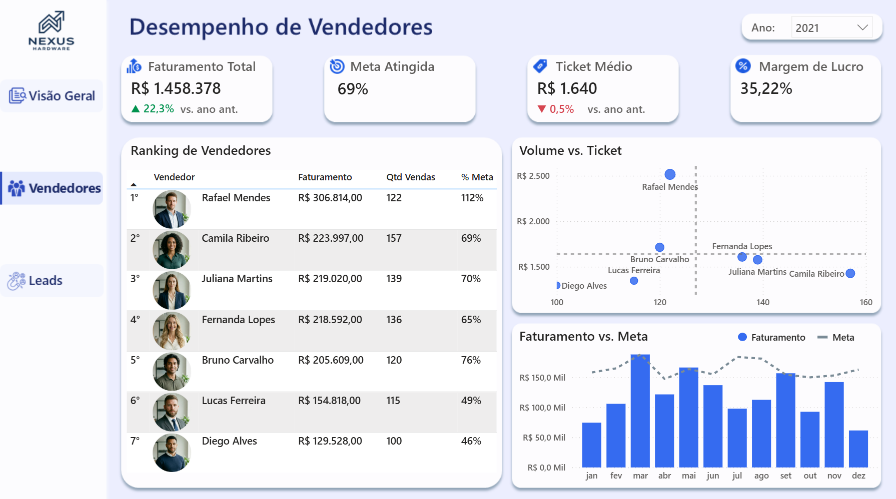
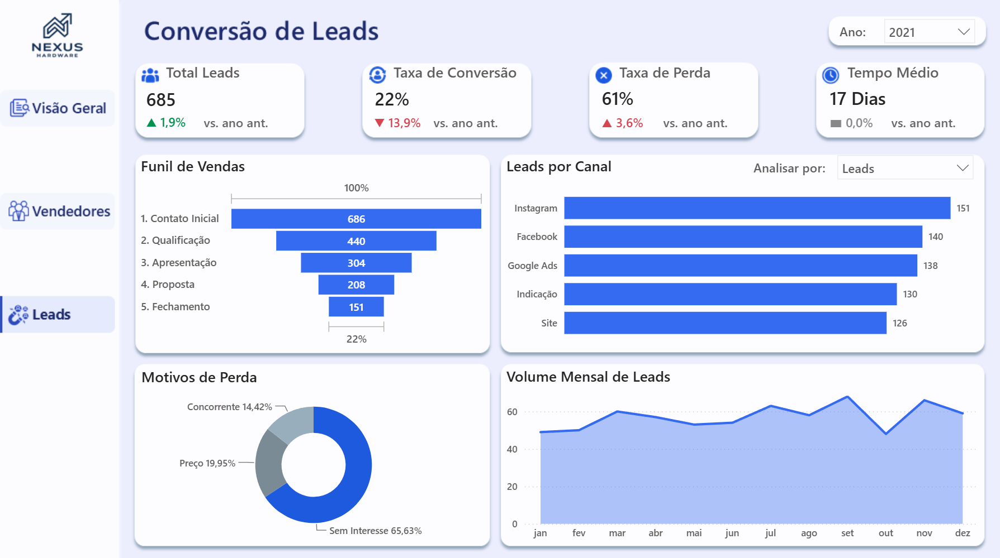
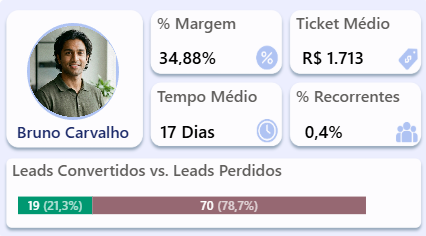

# Dashboard Performance Vendas

Dashboard em Power BI para acompanhar vendas, metas, vendedores e conversão de leads de uma empresa fictícia de hardware e produtos de escritório.

O projeto reúne indicadores comerciais, análise de vendedores, funil de leads e uma estrutura de atualização baseada em arquivos Excel/CSV tratados no Power Query.



---

## Sobre o projeto

A ideia do dashboard é acompanhar a performance comercial da empresa de forma simples e visual.

O relatório foi dividido em três páginas:

* **Visão Geral de Vendas**
* **Desempenho de Vendedores**
* **Conversão de Leads**

Cada página foi pensada para responder uma parte da operação comercial: resultado geral, desempenho individual dos vendedores e acompanhamento dos leads no funil de vendas.

---

## Prévia do dashboard

### Visão Geral de Vendas



### Desempenho de Vendedores



### Conversão de Leads



### Tooltip de Vendedor



---

## O que o dashboard acompanha

Entre os principais indicadores do projeto estão:

* faturamento total;
* total de vendas;
* lucro total;
* margem de lucro;
* ticket médio;
* percentual de meta atingida;
* taxa de conversão de leads;
* taxa de perda de leads;
* tempo médio de conversão;
* ranking de vendedores;
* faturamento por categoria, subcategoria, marca e produto.

As regras de cálculo estão detalhadas em [`docs/metricas-e-regras.md`](docs/metricas-e-regras.md).

---

## Páginas do relatório

### Visão Geral de Vendas

A primeira página traz uma visão geral do resultado comercial.

Ela inclui:

* cards com os principais KPIs;
* comparação com o ano anterior;
* gráfico de faturamento ou quantidade de vendas;
* ranking dos três principais vendedores;
* meta atingida por trimestre ou por ano;
* faturamento por categoria com drill down.

O gráfico principal permite alternar entre **faturamento** e **quantidade de vendas**.

Quando um ano está selecionado, a análise aparece por mês. Quando nenhum ano está selecionado, o gráfico passa a mostrar os anos da base.

---

### Desempenho de Vendedores

A segunda página aprofunda a análise por vendedor.

Ela inclui:

* ranking completo de vendedores;
* faturamento;
* quantidade de vendas;
* percentual de meta atingida;
* ticket médio;
* margem de lucro;
* comparação entre volume de vendas e ticket médio;
* gráfico de faturamento vs. meta;
* tooltip personalizado com informações complementares.

Ao clicar em um vendedor na tabela, parte dos visuais da página é filtrada para mostrar o desempenho daquele vendedor.

O gráfico **Volume vs. Ticket** compara os vendedores usando quantidade de vendas no eixo X e ticket médio no eixo Y. As linhas pontilhadas representam as médias gerais, ajudando a identificar vendedores acima ou abaixo da média nos dois critérios.

---

### Conversão de Leads

A terceira página acompanha o processo de conversão comercial.

Ela inclui:

* total de leads;
* taxa de conversão;
* taxa de perda;
* tempo médio de conversão;
* funil de vendas;
* leads por canal;
* motivos de perda;
* volume mensal ou anual de leads.

O gráfico de leads por canal permite escolher o indicador analisado:

* leads totais;
* leads convertidos;
* tempo médio de conversão.

---

## Recursos usados no dashboard

Alguns recursos trabalhados no projeto:

* navegação lateral entre páginas;
* filtro por ano;
* comparativo YoY nos KPIs;
* títulos dinâmicos;
* eixo dinâmico mensal/anual;
* troca de indicador em gráficos;
* drill down em categoria, subcategoria, marca e produto;
* tooltip personalizado por vendedor;
* tratamento e combinação de arquivos no Power Query.

---

## Tratamento dos dados

Os dados foram tratados no Power Query.

A principal lógica do tratamento foi permitir que o dashboard seja atualizado a partir de arquivos adicionados em uma pasta.

O fluxo usado foi:

```text
1. Buscar todos os arquivos da pasta de vendas
2. Filtrar somente os arquivos de vendas
3. Transformar os arquivos encontrados
4. Combinar tudo em uma única tabela
5. Tratar as tabelas auxiliares
6. Carregar os dados no modelo do Power BI
```

Com isso, novos arquivos de vendas podem ser adicionados à pasta, desde que mantenham o mesmo padrão de colunas.

Mais detalhes sobre o tratamento estão em [`power-query/tratamento-dados.md`](power-query/tratamento-dados.md).

---

## Dados utilizados

Os dados estão organizados na pasta [`data/`](data/).

```text
data/
├── apoio/
└── vendas/
```

A pasta `vendas/` contém os arquivos anuais de vendas.

A pasta `apoio/` contém tabelas auxiliares, como clientes, produtos, vendedores, metas, leads, funil e imagens dos vendedores.

Mais detalhes sobre os arquivos estão em [`data/README.md`](data/README.md).

Todos os dados do projeto são fictícios, incluindo nomes, fotos dos vendedores, clientes, produtos, vendas, metas e leads.

---

## Estrutura do repositório

```text
dashboard-performance-vendas/
│
├── dashboard/
│   └── dashboard-performance-vendas.pbix
│
├── data/
│   ├── apoio/
│   ├── vendas/
│   └── README.md
│
├── docs/
│   └── metricas-e-regras.md
│
├── images/
│   ├── capa.png
│   ├── visao-geral.png
│   ├── vendedores.png
│   ├── leads.png
│   └── tooltip-vendedor.png
│
├── power-query/
│   └── tratamento-dados.md
│
├── LICENSE
└── README.md
```

---

## Ferramentas utilizadas

* Power BI
* Power Query
* DAX
* Excel
* CSV

---

## Como visualizar

O arquivo do dashboard está na pasta [`dashboard/`](dashboard/).

Para visualizar o projeto:

1. baixe o arquivo `.pbix`;
2. abra no Power BI Desktop;
3. confira se os caminhos dos arquivos em `data/` estão corretos;
4. atualize os dados, se necessário.

Caso o Power BI não encontre os arquivos, será necessário ajustar o caminho da pasta no Power Query.

---

## Aprendizados

Durante o desenvolvimento, trabalhei principalmente com:

* criação de um relatório com múltiplas páginas;
* tratamento de dados no Power Query;
* combinação de arquivos de uma pasta;
* criação de medidas DAX;
* comparação com ano anterior;
* uso de eixos e títulos dinâmicos;
* criação de tooltips personalizados;
* construção de navegação e experiência de uso no Power BI.

---

## Observação

Este projeto foi desenvolvido para portfólio, usando uma base fictícia de uma empresa de hardware e produtos de escritório.

O objetivo foi construir um dashboard comercial completo, com dados de vendas, vendedores, metas e leads, simulando um cenário comum de acompanhamento de performance em uma área comercial.
